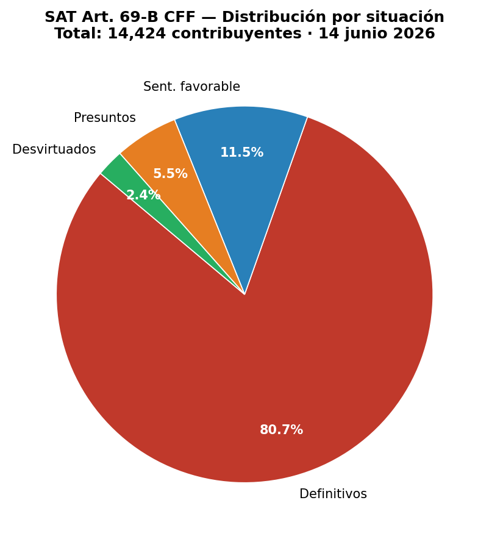

# Análisis de Contribuyentes 69-B (SAT México)


Análisis estadístico y visualización del **Listado Art. 69-B CFF** publicado por el SAT (EFOS/EDOS).

Genera gráficas de distribución por situación (presuntos, definitivos, desvirtuados y sentencias favorables) y exporta un resumen en CSV.

> **Fuente del CSV:** este repositorio consume el listado procesado por
> [sat-efos-tracker](https://github.com/Ar0d3x/sat-efos-tracker), que descarga
> el archivo original directamente del portal del SAT. Nunca de intermediarios
> ni software contable.

---

## Repositorios relacionados

| Repo | Rol |
|---|---|
| [sat-efos-tracker](https://github.com/Ar0d3x/sat-efos-tracker) | Descarga y monitorea el listado semanalmente |
| **Analisis_Contribuyentes_69B_SAT** (este repo) | Consume el CSV y genera visualizaciones |

**Flujo recomendado:**
```
sat-efos-tracker → python scheduler.py --now   # actualiza el CSV
         ↓
Analisis_Contribuyentes_69B_SAT → python analisis_69b.py   # genera gráficas
```

---

## Ejemplo de output



```
=======================================================
  SAT Art. 69-B CFF — Resumen al 2026-06-14 18:15
=======================================================
  Total contribuyentes : 13,451
-------------------------------------------------------
  Definitivos          :  10,994   (81.73%)
  Otros                :   1,600   (11.90%)
  Presuntos            :     519   ( 3.86%)
  Desvirtuados         :     338   ( 2.51%)
=======================================================
```

---

## Instalación

### 1. Clonar y preparar entorno

```bash
git clone https://github.com/Ar0d3x/Analisis_Contribuyentes_69B_SAT.git
cd Analisis_Contribuyentes_69B_SAT
```

Activar el entorno virtual de `sat-efos-tracker` (recomendado para no duplicar dependencias):

```bash
source ../sat-efos-tracker/.venv/bin/activate
```

O crear uno nuevo:

```bash
python3 -m venv .venv
source .venv/bin/activate
```

### 2. Instalar dependencias

```bash
pip install pandas matplotlib seaborn numpy
```

### 3. Ejecutar

```bash
python analisis_69b.py
```

El script busca el CSV automáticamente en estas rutas (en orden):

1. `../sat-efos-tracker/data/processed/listado_69b_latest.csv` ← recomendada
2. `~/Downloads/files/data/processed/listado_69b_latest.csv`
3. `Listado_Completo_69-B.csv` en la misma carpeta (legacy)

---

## Output generado

```
output/
├── analisis_69b_YYYYMMDD.png    ← gráfica de pastel + barras
└── resumen_69b_YYYYMMDD_HHMM.csv ← tabla de conteos y porcentajes
```

---

## Fundamento legal

- **Art. 69-B CFF** — presunción de operaciones inexistentes (EFOS)
- **Art. 113 Bis CFF** — sanción penal de 2 a 9 años por CFDI de operaciones simuladas
- **Plazo para desvirtuar:** 30 días hábiles desde la publicación como presunto

---

## Aviso legal

Este repositorio procesa datos públicos del SAT para facilitar el análisis estadístico.
**No sustituye la consulta directa al portal oficial del SAT ni al DOF.**
No constituye asesoría legal o fiscal.

---

## Autor

**David Nieto** — Abogado, Contador Público y Doctor en Derecho (en formación)  
Especialista en derecho fiscal, tributario y penal  
Investigador en IA, Administraciones Tributarias y Derechos Humanos

🔐 Contacto seguro (PGP): [github.com/Ar0d3x/public-key-nieto](https://github.com/Ar0d3x/public-key-nieto)  
🐙 GitHub: [@Ar0d3x](https://github.com/Ar0d3x)

---

## Licencia

MIT — libre para usar, modificar y distribuir citando al autor.
